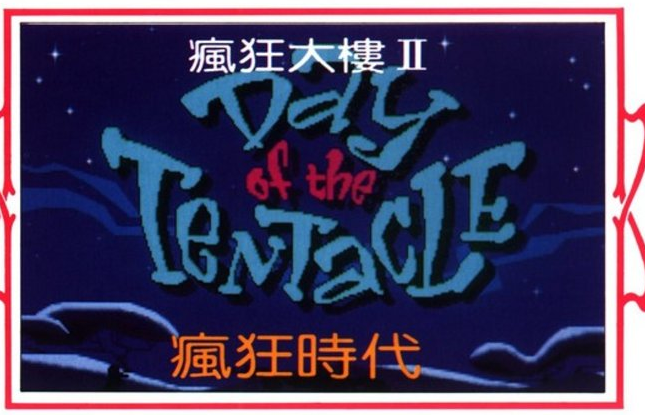
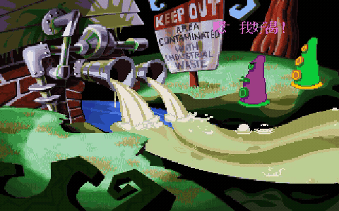
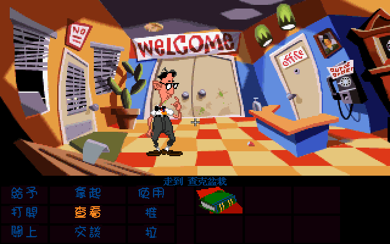
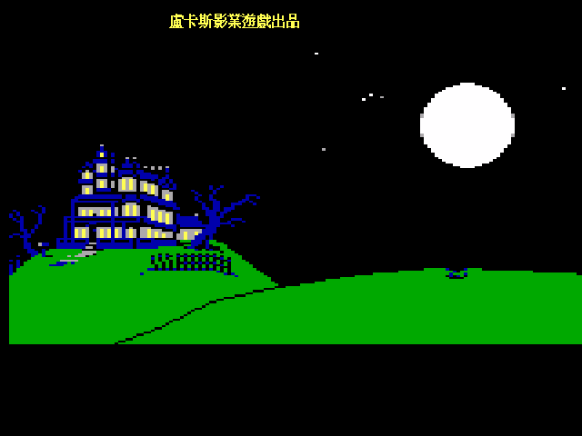
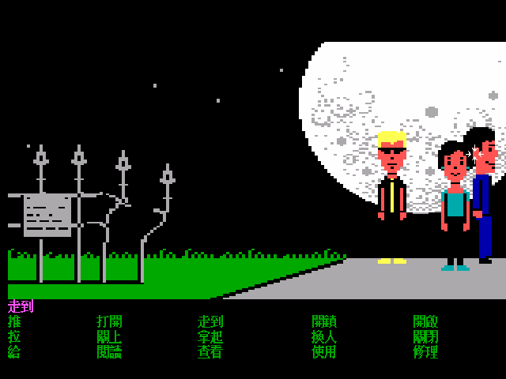
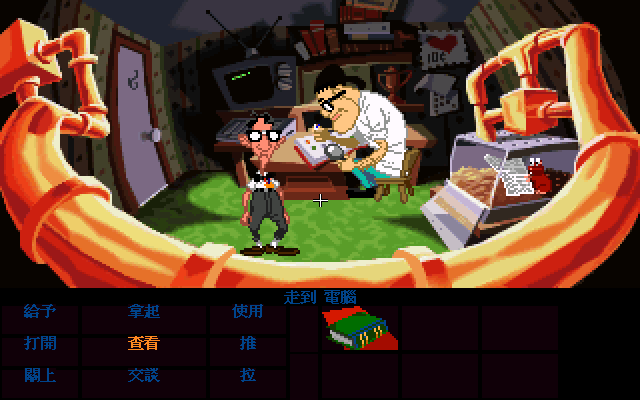
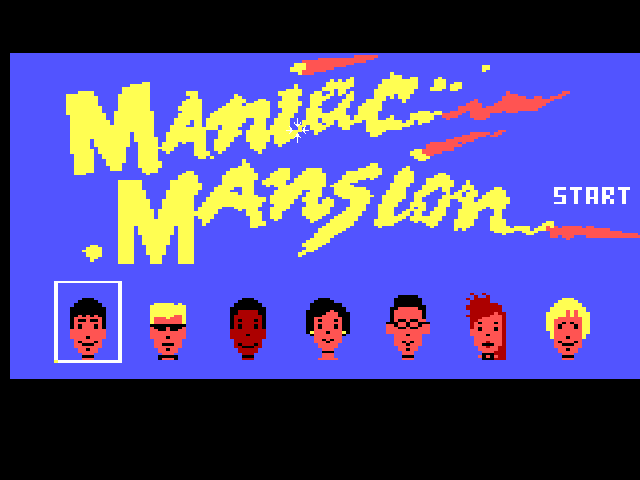

# 瘋狂時代 — 瘋狂大樓 II　繁體中文化（Day of the Tentacle，SCUMM v6）

紫色觸手喝了一口從佛瑞德博士實驗室後面流出來的廢水。隔天早上它長出手臂、學會說話，然後宣布要統治全世界。

博士的補救辦法，是把伯納和他兩個朋友塞進一台用行動廁所改造的時光機，回到前一天把廢水關掉。機器只送對了一個人——一個掉進兩百年前的美國建國現場，一個落到兩百年後、觸手已經接管人類的世界。三個人卡在三個時代，唯一還能互相傳東西的管道，是各自那間廁所。

這個 repo 把這條路上的每一句話翻成繁體中文。**連泰德房間那台電腦裡的一代《瘋狂大樓》一起**——那是原版就附在光碟裡的完整遊戲，在這裡它也會是中文的。

repo 只有碼表、譯文、字型工具與引擎修補，不含遊戲資料。想直接玩，跳到〈怎麼玩〉。

> **v1.1 已釋出 → [下載 Linux／Windows／macOS 安裝包](https://github.com/wicanr2/day_of_the_tentacle_cht/releases/tag/v1.1)**
>
> 兩條產線的譯文都已完成：瘋狂時代 4,239 句、一代 859 句，回填全部 byte-perfect。
> 泰德電腦裡的一代已在遊戲內實測跳得進去（見下方截圖）。
> 進度細節見 [`docs/50-status.md`](docs/50-status.md)。
> 姊妹專案：[《瘋狂大樓》一代繁中化](https://github.com/wicanr2/maniac_mansion_cht)。

## 兩套遊戲，兩條產線

《瘋狂時代》的光碟裡藏著一整套一代。遊戲裡走到泰德房間，打開那台電腦，就能從頭玩完 1987 年的《瘋狂大樓》。當年《遊戲獵人》雜誌的評測末尾特地提了一句：

> 附帶一提，在瘋狂時代還附贈了瘋狂大樓的遊戲，沒玩過的玩家若有興趣也可以順道玩上一玩！

那不是一段致敬動畫，是真的整套遊戲。ScummVM 的處理方式也很直接：它把那一代當成**另一個獨立的遊戲**啟動，玩完再切回來，《瘋狂時代》的進度原封不動。所以「讓電腦裡的一代也是中文的」不是加個字串表就好，而是一次完整的中文化。

|  | 瘋狂時代（本體） | 泰德電腦裡的一代 |
|---|---|---|
| 引擎 | SCUMM v6（CD 語音版） | **SCUMM v1**（1987 DOS 原版） |
| ScummVM gameid | `tentacle` | `maniac`（variant `V1`） |
| 資料 | `TENTACLE.000/.001` ＋ `monster.sof` | 光碟 `DOTT/MANIAC/` 下的 54 個 `.LFL` |
| 譯文 | 4,239 句 | 859 句 |
| 字模 | 倚天 16×14 | 倚天 16×15 |
| 碼空間首碼 | `0xA1–0xF7` | `0x88–0x9F` |
| 語音 | 英文原音／中文 TTS（遊戲中 Ctrl+T 切換）＋ 中文字幕 | 無語音 |

在《瘋狂時代》裡對怪異愛德房間那台電腦下「使用」，ScummVM 就切進中文版的一代：

一代專案做的是 1988 年的 Enhanced 版（SCUMM v2），與光碟裡這份 **V1 不是同一套資料**（md5 已比對，見技術文件）。譯文移植得過來，工程要重做一遍。

## 技術路線

| 項目 | 選擇 |
|---|---|
| 字型 | 倚天中文系統（ETEN 3.53）的 15 點原生點陣字，畫在 2 倍的文字表面上 |
| 字模 | 瘋狂時代 16×14（裁掉全空的末列）；一代 16×15（原尺寸） |
| 碼空間 | 瘋狂時代首碼 `0xA1–0xF7`；一代收窄到 `0x88–0x9F`，避開 SCUMM v1/v2 的空白壓縮 |
| 抽字／回填 | [ScummTR](https://github.com/dwatteau/scummtr)，另補兩個 v1 無損修補 |
| 中文開關 | 遊戲夾放 `chinese_gb16x12.fnt`，ScummVM 偵測到即切 CJK 路徑 |
| 引擎修補 | 單一 patch 檔，涵蓋兩條產線（`patches/scummvm-zhtw.patch`） |

`GID_TENTACLE` 本來就在 ScummVM 的中文白名單裡，走 12×12 字型可以完全不改引擎——但那條路在本作走不通，原因不是碼空間而是幾何：句子列到指令第一列只有 7 個邏輯像素，12×12 的 CJK 行高是 13，直接壓上去。改走倚天 15 點、裁成 16×14 之後邏輯高剛好 7，與原版英文一致，版面一處都不必改。推導與踩過的雷寫在 [`docs/20-patches.md`](docs/20-patches.md)。

## 譯名

一代出現過的角色沿用[一代已定案的譯名表](https://github.com/wicanr2/maniac_mansion_cht/blob/main/docs/10-glossary.md)（來源：軟體世界貴族版第 068 號中文說明書）：伯納、佛瑞德博士、愛德娜護士、怪異愛德、泰德。

兩隻觸手是例外。一代說明書把 Purple Tentacle 譯作「紫色怪物」、Green Tentacle 譯作「大食怪」，那是為「擋路的怪物」這個定位取的；到了本作牠們是有人格、有台詞的主角級角色，沿用會嚴重失準。本作改用**紫色觸手／綠色觸手**，泰德電腦裡的一代也跟著統一——同一份交付物裡不該有兩套稱呼。完整譯名表與逐條理由在 [`docs/10-glossary.md`](docs/10-glossary.md)。

遊戲名採當年《遊戲獵人》雜誌（松崗）評測所用的**《瘋狂大樓 II — 瘋狂時代》**。

## 怎麼玩

需要自備《Day of the Tentacle》**1993 年的原始 CD 版**資料：`TENTACLE.000`、
`TENTACLE.001`、`monster.sof`（語音，可省），以及光碟裡 `MANIAC/` 資料夾下的
54 個 `.LFL`。Steam／GOG 的 Remastered 版格式不同，不適用。

[v1.1 的安裝包](https://github.com/wicanr2/day_of_the_tentacle_cht/releases/tag/v1.1)
裡有引擎、中文字型、譯文與一鍵套用腳本，但**不含遊戲資料**：

| 平台 | 套用 | 開始玩 |
|---|---|---|
| Windows | 把原版資料夾拖到「套用中文化.bat」上 | `執行遊戲.bat` |
| Linux | `./套用中文化.sh /路徑/到/原版` | `./執行遊戲.sh` |
| macOS | `./套用中文化.command /路徑/到/原版` | 開啟 `.app` |

腳本會把原版複製一份到包裡的 `game/` 之後才動手，不會改到你的原版。

玩到中期用伯納打開泰德房間那台電腦，就會跳進中文版的一代；玩完切回來，
《瘋狂時代》的進度原封不動。

### 設定檔的三個雷

ScummVM 要設**兩個 target**，範本在
[`dist/scummvm-zhtw.ini.sample`](dist/scummvm-zhtw.ini.sample)（安裝包已經設好）。
自己改的話有三件事寫錯就進不去，都是實際踩過的：

- **註解只能用 `#`，不能用 `;`。** ScummVM 的設定解析器只認 `#`，遇到 `;`
  開頭的行會判定檔案有問題而整份丟掉，症狀是說 `Unrecognized game`，
  看起來像 target 名字打錯。
- **`easter_egg` 要明確指到一代的 target 名。** 不寫的話走路徑搜尋，
  而同一份 LFL 同時符合 C64／V1 DOS／NES，會挑到第一個候選（C64），
  啟動時直接 assertion 中止。
- **兩個 target 都不要寫 `language`。** ScummVM 看到遊戲夾裡有
  `chinese_gb16x12.fnt` 就會判成中文；手寫 `language=zh` 反而被當成別的中文變體，
  不載字型、整片亂碼。

### 字型

安裝包裡的中文字型烘自 **WenQuanYi Zen Hei Sharp 的 15px embedded bitmap**
（設計師手繪的點陣，GPL + 字體例外條款）。開發時另有一份倚天中文系統的原生點陣字，
筆畫更銳利，但那是商業字型的衍生物，只留本機不散布。兩份的字模尺寸與碼位完全相同，
換檔就換字形。

## 中文語音

字幕之外還做了中文配音，遊戲中按 **Ctrl+T** 就地切換三組：

| | 怎麼來的 | 聽起來 |
|---|---|---|
| 原版英文 | 1993 年的錄音 | — |
| 台式中文 | edge-tts 的三個台灣聲音 | 標準的台灣中文，音高照原音的基頻挑，同一角色的句子落在同一個音高帶 |
| 原音克隆 | F5-TTS 拿英文原音當範本 | 角色用**自己的聲音**講中文，代價是帶著英文母語者的中文腔 |

沒有「哪一句是誰說的」這份資料，所以不靠認角色，而是量每一段原音的基頻（F0）
分成 10 個音高帶，帶的中心頻率就是那組句子該有的音高。4,431 句全量合成，
再逐段把響度對齊原版的 RMS。

切換的實作只有一件事：三份 `.sof` 的索引表完全一致，差別只有音訊本身，
所以換語音等於換一個檔名再重讀一次索引——腳本與存檔都不用動。
機制與量測見 [`docs/60-voice.md`](docs/60-voice.md)。

**語音包不散布，也不在 Release 裡**：它是原版 `monster.sof` 的改造版（沒翻到的
113 段仍是原音），而且 edge-tts 走的是微軟的線上服務。repo 與安裝包裡只有
產生它的工具，沒放語音時遊戲就是原本的英文原音。

## 1993 年的評語

當年《遊戲獵人》「群英會審」欄五位編輯的短評，抄兩則：

> 劇情張力十足，超廣的想像空間，絕對適合喜歡不按常理出牌，且具瘋狂想像力的玩家，是一部幽默詼諧而又混亂瘋狂的好作品。　—— MR.i

> 可愛逗趣的三名主角，搭配上幽默的劇情、對話。不愧是 LucasArts 年度大作。音樂及音效運用更是出神入化，給人很「卡通」的感覺。　—— GEMINI

## 資料來源與版權

- `banner/title-1993.png` 裁自《遊戲獵人》雜誌（松崗，作者代號 GEMINI）1993 年對本作的評測跨頁，僅供譯名與在地發行史考據之用，著作權屬原出版者。整頁掃描留在本機，不入公開 repo。
- 遊戲本體、CD 語音、MT-32 ROM 等版權物一律不入本 repo。
- 本 repo 自行撰寫的工具、修補與譯文採 MIT 授權（見 `LICENSE`）。
